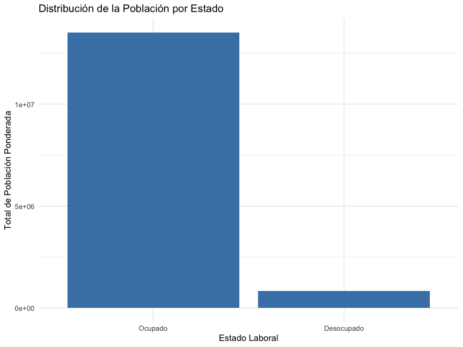
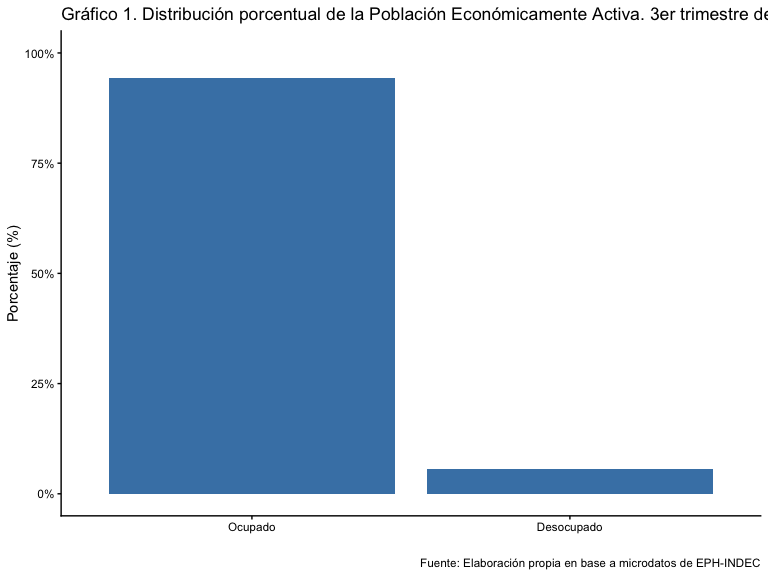
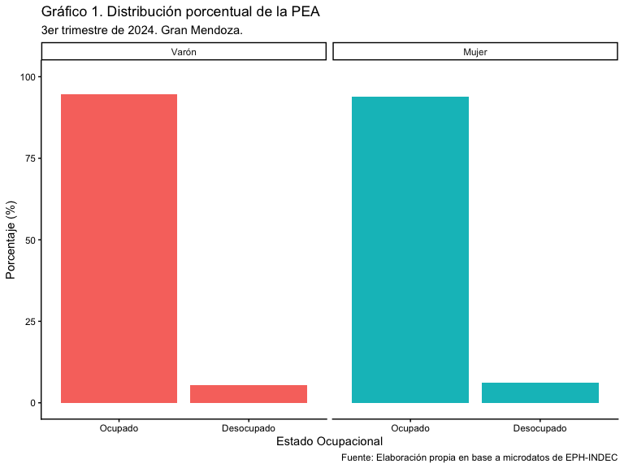
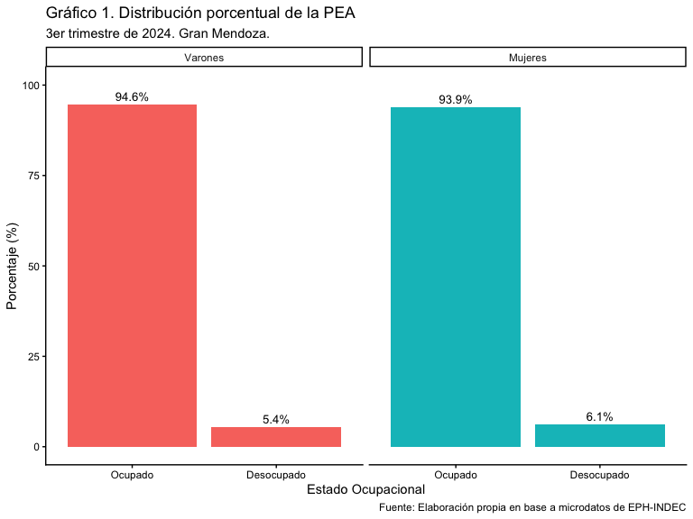

# Introducción

En esta clase vamos centrarnos en tablas y gráficos. Para las tablas tomaremos el paquete `knitr` cuya función `kable` nos va a ayudar a hacer tablas bien piolas y que una versión mas copada la tendremos con `kableExtra` y para los gráficos al glorioso `ggplo2` que lo tenemos en el superpaquete `tidyverse`. A lo largo de la sesión, abordaremos los siguientes temas:

✅ **Parte 1: ¿Qué es y cómo funciona `{kableExtra}`?**
✅ **Parte 2: ¿Qué es y como funciona `{ggplot2}`?.**
✅ **Parte 3: Full práctica.** intentaremos sacarle la ficha al asunto.


La clase tiene una duración de **2 horas y 30 minutos**, con **dos
recreos de 15 minutos** para que podamos despejarnos y mover las
piernas.

# Parte 1: ¿Qué es y cómo funciona **`kableExtra`**?

Como dijimos mas o menos, el paquete `kableExtra` extiende la funcionalidad de `kable()` del paquete `knitr`, permitiendo crear tablas bien formateadas en diferentes formatos, como HTML, LaTeX y Markdown. Este paquete es particularmente útil para la creación de reportes en `RMarkdown` que veremos en la ultímisima clase.

# Instalación/Carga de paquetes en R

Para instalar un paquete desde CRAN, usamos:


``` r
install.packages("eph") # Instala el paquete eph
```

```
## 
## The downloaded binary packages are in
## 	/var/folders/bg/v72nhx3930sc4dp9p25dbn240000gp/T//Rtmp1OH1zU/downloaded_packages
```

``` r
install.packages("knitr") #Que tiene kable original
```

```
## 
## The downloaded binary packages are in
## 	/var/folders/bg/v72nhx3930sc4dp9p25dbn240000gp/T//Rtmp1OH1zU/downloaded_packages
```

``` r
install.packages("kableExtra")  # Instala el paquete kableExtra
```

```
## 
## The downloaded binary packages are in
## 	/var/folders/bg/v72nhx3930sc4dp9p25dbn240000gp/T//Rtmp1OH1zU/downloaded_packages
```

``` r
install.packages("tidyverse")  # Que instala el paquete ggplot2 
```

```
## 
## The downloaded binary packages are in
## 	/var/folders/bg/v72nhx3930sc4dp9p25dbn240000gp/T//Rtmp1OH1zU/downloaded_packages
```

Para cargar un paquete ya instalado:


``` r
library(tidyverse)  # Carga ggplot2 en la sesión de R así con el resto si lo instalaron antes
```

Para ver los paquetes instalados en tu sistema:


``` r
installed.packages()[,1]  # Muestra una lista de paquetes instalados
```

```
##             askpass             assertr           backports                base 
##           "askpass"           "assertr"         "backports"              "base" 
##           base64enc                 bit               bit64            blastula 
##         "base64enc"               "bit"             "bit64"          "blastula" 
##                blob            bookdown                boot               broom 
##              "blob"          "bookdown"              "boot"             "broom" 
##               bslib              cachem               callr          cellranger 
##             "bslib"            "cachem"             "callr"        "cellranger" 
##           checkmate               class            classInt                 cli 
##         "checkmate"             "class"          "classInt"               "cli" 
##               clipr             cluster           codetools          commonmark 
##             "clipr"           "cluster"         "codetools"        "commonmark" 
##            compiler          conflicted               cpp11              crayon 
##          "compiler"        "conflicted"             "cpp11"            "crayon" 
##           crosstalk                curl          data.table      data.validator 
##         "crosstalk"              "curl"        "data.table"    "data.validator" 
##            datasets                 DBI              dbplyr              digest 
##          "datasets"               "DBI"            "dbplyr"            "digest" 
##               dplyr              dtplyr               e1071                 eph 
##             "dplyr"            "dtplyr"             "e1071"               "eph" 
##            evaluate               expss               fansi              farver 
##          "evaluate"             "expss"             "fansi"            "farver" 
##             fastmap       flexdashboard         fontawesome             forcats 
##           "fastmap"     "flexdashboard"       "fontawesome"           "forcats" 
##             foreign                  fs              gargle            generics 
##           "foreign"                "fs"            "gargle"          "generics" 
##             getPass             ggplot2                glue         googledrive 
##           "getPass"           "ggplot2"              "glue"       "googledrive" 
##       googlesheets4            graphics           grDevices                grid 
##     "googlesheets4"          "graphics"         "grDevices"              "grid" 
##           gridExtra              gtable               haven                here 
##         "gridExtra"            "gtable"             "haven"              "here" 
##               highr                 hms           htmlTable           htmltools 
##             "highr"               "hms"         "htmlTable"         "htmltools" 
##         htmlwidgets              httpuv                httr                 ids 
##       "htmlwidgets"            "httpuv"              "httr"               "ids" 
##             isoband           jquerylib            jsonlite          kableExtra 
##           "isoband"         "jquerylib"          "jsonlite"        "kableExtra" 
##          KernSmooth               knitr            labeling            labelled 
##        "KernSmooth"             "knitr"          "labeling"          "labelled" 
##               later             lattice            lazyeval             leaflet 
##             "later"           "lattice"          "lazyeval"           "leaflet" 
##   leaflet.providers           lifecycle           lubridate              maditr 
## "leaflet.providers"         "lifecycle"         "lubridate"            "maditr" 
##            magrittr                MASS              Matrix         matrixStats 
##          "magrittr"              "MASS"            "Matrix"       "matrixStats" 
##             memoise             methods                mgcv                mime 
##           "memoise"           "methods"              "mgcv"              "mime" 
##              modelr                nlme                nnet             openssl 
##            "modelr"              "nlme"              "nnet"           "openssl" 
##            openxlsx              pacman            parallel              pillar 
##          "openxlsx"            "pacman"          "parallel"            "pillar" 
##           pkgconfig              plotly                 png         prettyunits 
##         "pkgconfig"            "plotly"               "png"       "prettyunits" 
##            processx            progress            promises               proxy 
##          "processx"          "progress"          "promises"             "proxy" 
##                  ps               purrr                  R6                ragg 
##                "ps"             "purrr"                "R6"              "ragg" 
##            rappdirs              raster        RColorBrewer                Rcpp 
##          "rappdirs"            "raster"      "RColorBrewer"              "Rcpp" 
##               readr              readxl             rematch            rematch2 
##             "readr"            "readxl"           "rematch"          "rematch2" 
##             remotes              reprex               rlang           rmarkdown 
##           "remotes"            "reprex"             "rlang"         "rmarkdown" 
##          rmdformats               rpart           rprojroot          rstudioapi 
##        "rmdformats"             "rpart"         "rprojroot"        "rstudioapi" 
##               rvest                  s2                  S7                sass 
##             "rvest"                "s2"                "S7"              "sass" 
##              scales             selectr     semantic.assets                  sf 
##            "scales"           "selectr"   "semantic.assets"                "sf" 
##               shiny      shiny.semantic         sourcetools                  sp 
##             "shiny"    "shiny.semantic"       "sourcetools"                "sp" 
##             spatial             splines               stats              stats4 
##           "spatial"           "splines"             "stats"            "stats4" 
##             stringi             stringr            survival             svglite 
##           "stringi"           "stringr"          "survival"           "svglite" 
##                 sys         systemfonts               tcltk               terra 
##               "sys"       "systemfonts"             "tcltk"             "terra" 
##         textshaping              tibble               tidyr          tidyselect 
##       "textshaping"            "tibble"             "tidyr"        "tidyselect" 
##           tidyverse          timechange             tinytex               tools 
##         "tidyverse"        "timechange"           "tinytex"             "tools" 
##                tzdb               units                utf8               utils 
##              "tzdb"             "units"              "utf8"             "utils" 
##                uuid               vctrs             viridis         viridisLite 
##              "uuid"             "vctrs"           "viridis"       "viridisLite" 
##               vroom               withr                  wk             writexl 
##             "vroom"             "withr"                "wk"           "writexl" 
##                xfun                xml2              xtable                yaml 
##              "xfun"              "xml2"            "xtable"              "yaml" 
##                 zip                 zoo 
##               "zip"               "zoo"
```

# Características clave de **`kableExtra`**

- Mejora la apariencia de las tablas generadas con `kable()`.
- Soporta múltiples formatos: Markdown, HTML, LaTeX.
- Permite añadir títulos, subtítulos, colores, alineaciones y agrupaciones.
- Facilita la personalización de bordes y estilos.
- Ideal para reportes en `RMarkdown`.

# Cargamos base de datos

Base de datos EPH individual para el **4to trimestre de
2023**, usamos:


``` r
library(eph)  # Asegurar que el paquete está cargado

eph_data <- get_microdata(year = 2023, trimester = 4, type = "individual")

# Ver primeras filas de la base
dim(eph_data)
```

```
## [1] 47337   235
```

``` r
colnames(eph_data)
```

```
##   [1] "CODUSU"     "ANO4"       "TRIMESTRE"  "NRO_HOGAR"  "COMPONENTE"
##   [6] "H15"        "REGION"     "MAS_500"    "AGLOMERADO" "PONDERA"   
##  [11] "CH03"       "CH04"       "CH05"       "CH06"       "CH07"      
##  [16] "CH08"       "CH09"       "CH10"       "CH11"       "CH12"      
##  [21] "CH13"       "CH14"       "CH15"       "CH15_COD"   "CH16"      
##  [26] "CH16_COD"   "NIVEL_ED"   "ESTADO"     "CAT_OCUP"   "CAT_INAC"  
##  [31] "IMPUTA"     "PP02C1"     "PP02C2"     "PP02C3"     "PP02C4"    
##  [36] "PP02C5"     "PP02C6"     "PP02C7"     "PP02C8"     "PP02E"     
##  [41] "PP02H"      "PP02I"      "PP03C"      "PP03D"      "PP3E_TOT"  
##  [46] "PP3F_TOT"   "PP03G"      "PP03H"      "PP03I"      "PP03J"     
##  [51] "INTENSI"    "PP04A"      "PP04B_COD"  "PP04B1"     "PP04B2"    
##  [56] "PP04B3_MES" "PP04B3_ANO" "PP04B3_DIA" "PP04C"      "PP04C99"   
##  [61] "PP04D_COD"  "PP04G"      "PP05B2_MES" "PP05B2_ANO" "PP05B2_DIA"
##  [66] "PP05C_1"    "PP05C_2"    "PP05C_3"    "PP05E"      "PP05F"     
##  [71] "PP05H"      "PP06A"      "PP06C"      "PP06D"      "PP06E"     
##  [76] "PP06H"      "PP07A"      "PP07C"      "PP07D"      "PP07E"     
##  [81] "PP07F1"     "PP07F2"     "PP07F3"     "PP07F4"     "PP07F5"    
##  [86] "PP07G1"     "PP07G2"     "PP07G3"     "PP07G4"     "PP07G_59"  
##  [91] "PP07H"      "PP07I"      "PP07J"      "PP07K"      "PP08D1"    
##  [96] "PP08D4"     "PP08F1"     "PP08F2"     "PP08J1"     "PP08J2"    
## [101] "PP08J3"     "PP09A"      "PP09A_ESP"  "PP09B"      "PP09C"     
## [106] "PP09C_ESP"  "PP10A"      "PP10C"      "PP10D"      "PP10E"     
## [111] "PP11A"      "PP11B_COD"  "PP11B1"     "PP11B2_MES" "PP11B2_ANO"
## [116] "PP11B2_DIA" "PP11C"      "PP11C99"    "PP11D_COD"  "PP11G_ANO" 
## [121] "PP11G_MES"  "PP11G_DIA"  "PP11L"      "PP11L1"     "PP11M"     
## [126] "PP11N"      "PP11O"      "PP11P"      "PP11Q"      "PP11R"     
## [131] "PP11S"      "PP11T"      "P21"        "DECOCUR"    "IDECOCUR"  
## [136] "RDECOCUR"   "GDECOCUR"   "PDECOCUR"   "ADECOCUR"   "PONDIIO"   
## [141] "TOT_P12"    "P47T"       "DECINDR"    "IDECINDR"   "RDECINDR"  
## [146] "GDECINDR"   "PDECINDR"   "ADECINDR"   "PONDII"     "V3_M"      
## [151] "V4_M"       "V8_M"       "V9_M"       "V10_M"      "V12_M"     
## [156] "V18_M"      "V19_AM"     "T_VI"       "ITF"        "DECIFR"    
## [161] "IDECIFR"    "RDECIFR"    "GDECIFR"    "PDECIFR"    "ADECIFR"   
## [166] "IPCF"       "DECCFR"     "IDECCFR"    "RDECCFR"    "GDECCFR"   
## [171] "PDECCFR"    "ADECCFR"    "PONDIH"     "V2_02_M"    "V2_03_M"   
## [176] "V5_03_M"    "V11_02_M"   "PP07B1_01"  "EMPLEO"     "SECTOR"    
## [181] "PP02A"      "PP02B"      "PP02D"      "PP02F"      "PP02G"     
## [186] "PP03K"      "PP04A1"     "PP05B3"     "PP05I"      "PP05J"     
## [191] "PP05K"      "PP06E1"     "PP06K"      "PP06K_SEM"  "PP06K_MES" 
## [196] "PP06L"      "PP07F1_1"   "PP07F1_2"   "PP07F1_3"   "PP07I2"    
## [201] "PP07I3"     "PP07I4"     "PP07L"      "PP07M"      "PP08G"     
## [206] "PP08G_DSEM" "PP08G_DMES" "PP08H"      "PP10B1"     "PP10B2"    
## [211] "PP10B3"     "PP10B4"     "PP10B5"     "PP10B6"     "PP10B7"    
## [216] "PP10B8"     "PP10B9"     "PP10B10"    "PP11L2"     "V2_01_M"   
## [221] "V5_01_M"    "V5_02_M"    "V11_01_M"   "V21_01_M"   "V21_02_M"  
## [226] "V21_03_M"   "V22_01_M"   "V22_02_M"   "V22_03_M"   "P_DECCF"   
## [231] "P_RDECCF"   "P_GDECCF"   "P_PDECCF"   "P_IDECCF"   "P_ADECCF"
```

# Ejemplo 1: Filtramos la base `eph_data` para seleccionar algunas columnas de interés y mostrar los primeros 10 registros.


``` r
# Seleccionar algunas variables clave
tabla_eph <- eph_data %>%
  select(AGLOMERADO, CH04, CH06, P21, PONDERA) %>%
  head(10)

# Crear una tabla bien formateada con kableExtra
tabla_eph %>%
  kable(format = "html", caption = "Ejemplo de tabla con kableExtra") %>%
  kable_styling(bootstrap_options = c("striped", "hover", "condensed", "responsive"),
                full_width = FALSE, position = "center")
```

<table class="table table-striped table-hover table-condensed table-responsive" style="color: black; width: auto !important; margin-left: auto; margin-right: auto;">
<caption>Ejemplo de tabla con kableExtra</caption>
 <thead>
  <tr>
   <th style="text-align:right;"> AGLOMERADO </th>
   <th style="text-align:right;"> CH04 </th>
   <th style="text-align:right;"> CH06 </th>
   <th style="text-align:right;"> P21 </th>
   <th style="text-align:right;"> PONDERA </th>
  </tr>
 </thead>
<tbody>
  <tr>
   <td style="text-align:right;"> 33 </td>
   <td style="text-align:right;"> 2 </td>
   <td style="text-align:right;"> 54 </td>
   <td style="text-align:right;"> 300000 </td>
   <td style="text-align:right;"> 826 </td>
  </tr>
  <tr>
   <td style="text-align:right;"> 33 </td>
   <td style="text-align:right;"> 2 </td>
   <td style="text-align:right;"> 25 </td>
   <td style="text-align:right;"> 64000 </td>
   <td style="text-align:right;"> 3103 </td>
  </tr>
  <tr>
   <td style="text-align:right;"> 33 </td>
   <td style="text-align:right;"> 1 </td>
   <td style="text-align:right;"> 31 </td>
   <td style="text-align:right;"> 265000 </td>
   <td style="text-align:right;"> 2852 </td>
  </tr>
  <tr>
   <td style="text-align:right;"> 33 </td>
   <td style="text-align:right;"> 1 </td>
   <td style="text-align:right;"> 51 </td>
   <td style="text-align:right;"> 500000 </td>
   <td style="text-align:right;"> 1151 </td>
  </tr>
  <tr>
   <td style="text-align:right;"> 22 </td>
   <td style="text-align:right;"> 1 </td>
   <td style="text-align:right;"> 34 </td>
   <td style="text-align:right;"> 22000 </td>
   <td style="text-align:right;"> 105 </td>
  </tr>
  <tr>
   <td style="text-align:right;"> 22 </td>
   <td style="text-align:right;"> 1 </td>
   <td style="text-align:right;"> 57 </td>
   <td style="text-align:right;"> 90000 </td>
   <td style="text-align:right;"> 124 </td>
  </tr>
  <tr>
   <td style="text-align:right;"> 22 </td>
   <td style="text-align:right;"> 1 </td>
   <td style="text-align:right;"> 24 </td>
   <td style="text-align:right;"> 120000 </td>
   <td style="text-align:right;"> 166 </td>
  </tr>
  <tr>
   <td style="text-align:right;"> 33 </td>
   <td style="text-align:right;"> 1 </td>
   <td style="text-align:right;"> 60 </td>
   <td style="text-align:right;"> -9 </td>
   <td style="text-align:right;"> 916 </td>
  </tr>
  <tr>
   <td style="text-align:right;"> 13 </td>
   <td style="text-align:right;"> 1 </td>
   <td style="text-align:right;"> 55 </td>
   <td style="text-align:right;"> 400000 </td>
   <td style="text-align:right;"> 2145 </td>
  </tr>
  <tr>
   <td style="text-align:right;"> 8 </td>
   <td style="text-align:right;"> 1 </td>
   <td style="text-align:right;"> 29 </td>
   <td style="text-align:right;"> -9 </td>
   <td style="text-align:right;"> 182 </td>
  </tr>
</tbody>
</table>

``` r
print(tabla_eph)  # Imprimir tabla en consola
```

```
## # A tibble: 10 × 5
##    AGLOMERADO  CH04  CH06    P21 PONDERA
##         <int> <int> <int>  <int>   <int>
##  1         33     2    54 300000     826
##  2         33     2    25  64000    3103
##  3         33     1    31 265000    2852
##  4         33     1    51 500000    1151
##  5         22     1    34  22000     105
##  6         22     1    57  90000     124
##  7         22     1    24 120000     166
##  8         33     1    60     -9     916
##  9         13     1    55 400000    2145
## 10          8     1    29     -9     182
```

# ¿Qué hicimos?

1. **Filtramos datos de `eph_data`**: Seleccionamos las variables `AGLOMERADO` (aglomerado urbano), `CH04` (sexo), `CH06` (edad), `P21` (ingreso total) y `PONDERA` (factor de expansión).
2. **Creamos una tabla con `kable()`**:
   - Se especifica el formato `"html"` para salida web.
   - Se agrega un título a la tabla.
3. **Aplicamos estilos con `kable_styling()`**:
   - `striped`: filas con colores alternados.
   - `hover`: resaltado al pasar el cursor.
   - `condensed`: reduce el espaciado.
   - `responsive`: ajustable en pantallas pequeñas.
   - `full_width = FALSE`: la tabla no ocupa todo el ancho.
   - `position = "center"`: centra la tabla.

# Pero la tabla está bien horrible, le pongamos mas onda. Veamos lo que hicimos ayer

Renombramos la base y aplicamos los `mutates` correspondientes


``` r
# Tranformamos algunas variables

eph_3t24 <- eph_data %>% 
  mutate(
    Sexo = case_when(
      CH04 == 1 ~ "Varones",
      CH04 == 2 ~ "Mujeres"),
    Edad = case_when(
      CH06 <= 29 ~ "Hasta 29 años",
      CH06 >= 30 & CH06 <= 64 ~ "De 30 a 64 años",
      CH06 >= 65 ~ "65 años y más"),
    Estado = case_when(
      ESTADO == 0 ~ "No realizada",
      ESTADO == 1 ~ "Ocupado",
      ESTADO == 2 ~ "Desocupado",
      ESTADO == 3 ~ "Inactivo",
      ESTADO == 4 ~ "Menor de 10"))

#Chequeamos las mutaciones

tabla_eph2 <- eph_3t24 %>%
  select(Sexo, Edad, Estado) %>%
  head(10) 

view(tabla_eph2) #veamos que sale

#Embellecemos con KableExtra
tabla_eph2 %>%
  kable(format = "html", caption = "Control de variables") %>%
  kable_styling(bootstrap_options = c("striped", "hover", "condensed", "responsive"),
                full_width = FALSE, position = "center")
```

<table class="table table-striped table-hover table-condensed table-responsive" style="color: black; width: auto !important; margin-left: auto; margin-right: auto;">
<caption>Control de variables</caption>
 <thead>
  <tr>
   <th style="text-align:left;"> Sexo </th>
   <th style="text-align:left;"> Edad </th>
   <th style="text-align:left;"> Estado </th>
  </tr>
 </thead>
<tbody>
  <tr>
   <td style="text-align:left;"> Mujeres </td>
   <td style="text-align:left;"> De 30 a 64 años </td>
   <td style="text-align:left;"> Ocupado </td>
  </tr>
  <tr>
   <td style="text-align:left;"> Mujeres </td>
   <td style="text-align:left;"> Hasta 29 años </td>
   <td style="text-align:left;"> Ocupado </td>
  </tr>
  <tr>
   <td style="text-align:left;"> Varones </td>
   <td style="text-align:left;"> De 30 a 64 años </td>
   <td style="text-align:left;"> Ocupado </td>
  </tr>
  <tr>
   <td style="text-align:left;"> Varones </td>
   <td style="text-align:left;"> De 30 a 64 años </td>
   <td style="text-align:left;"> Ocupado </td>
  </tr>
  <tr>
   <td style="text-align:left;"> Varones </td>
   <td style="text-align:left;"> De 30 a 64 años </td>
   <td style="text-align:left;"> Ocupado </td>
  </tr>
  <tr>
   <td style="text-align:left;"> Varones </td>
   <td style="text-align:left;"> De 30 a 64 años </td>
   <td style="text-align:left;"> Ocupado </td>
  </tr>
  <tr>
   <td style="text-align:left;"> Varones </td>
   <td style="text-align:left;"> Hasta 29 años </td>
   <td style="text-align:left;"> Ocupado </td>
  </tr>
  <tr>
   <td style="text-align:left;"> Varones </td>
   <td style="text-align:left;"> De 30 a 64 años </td>
   <td style="text-align:left;"> Ocupado </td>
  </tr>
  <tr>
   <td style="text-align:left;"> Varones </td>
   <td style="text-align:left;"> De 30 a 64 años </td>
   <td style="text-align:left;"> Ocupado </td>
  </tr>
  <tr>
   <td style="text-align:left;"> Varones </td>
   <td style="text-align:left;"> Hasta 29 años </td>
   <td style="text-align:left;"> Ocupado </td>
  </tr>
</tbody>
</table>

``` r
view(tabla_eph2) #veamos que sale
```

Ahora vamos con la tabla posta, pero la vamos a ver en tibble


``` r
# Ahora si vamos con la tabla posta
tabla_eph3 <- 
  eph_3t24 %>% 
  count(Sexo, Edad, Estado) %>% 
  pivot_wider(names_from = Estado, values_from = n, values_fill = 0) %>% #cambiamos sexo por estado
  arrange(case_when(
    Edad == "Hasta 29 años" ~ 1,
    Edad == "De 30 a 64 años" ~ 2,
    Edad == "65 años y más" ~ 3))

print(tabla_eph3) #vemos que sale
```

```
## # A tibble: 6 × 7
##   Sexo    Edad          Desocupado Inactivo `No realizada` Ocupado `Menor de 10`
##   <chr>   <chr>              <int>    <int>          <int>   <int>         <int>
## 1 Mujeres Hasta 29 años        262     5135              3    2063          2866
## 2 Varones Hasta 29 años        302     4303             11    2783          2952
## 3 Mujeres De 30 a 64 a…        232     3260             25    7182             0
## 4 Varones De 30 a 64 a…        240      894             29    8386             0
## 5 Mujeres 65 años y más          8     3375              1     331             0
## 6 Varones 65 años y más         11     2111              5     567             0
```

#Confirmado todo, vamos directamente con KableExtra para hacer algo copado


``` r
## Generación de tabla con KableExtra
tabla_eph3 %>%
  kable(format = "html", caption = "Tabla 1. Conteo de varones y mujeres por grupos de edad y estado. 3er trimestre de 2024. Total país. Valores absolutos.") %>%
  kable_styling(bootstrap_options = c("striped", "hover", "condensed", "responsive"),  
                full_width = FALSE, position = "center") %>%
  footnote(general_title = "Fuente: Elaboración propia en base a microdatos de EPH-INDEC.", 
           general = "Nota: Los valores exhibidos no están ponderados")
```

<table class="table table-striped table-hover table-condensed table-responsive" style="color: black; width: auto !important; margin-left: auto; margin-right: auto;border-bottom: 0;">
<caption>Tabla 1. Conteo de varones y mujeres por grupos de edad y estado. 3er trimestre de 2024. Total país. Valores absolutos.</caption>
 <thead>
  <tr>
   <th style="text-align:left;"> Sexo </th>
   <th style="text-align:left;"> Edad </th>
   <th style="text-align:right;"> Desocupado </th>
   <th style="text-align:right;"> Inactivo </th>
   <th style="text-align:right;"> No realizada </th>
   <th style="text-align:right;"> Ocupado </th>
   <th style="text-align:right;"> Menor de 10 </th>
  </tr>
 </thead>
<tbody>
  <tr>
   <td style="text-align:left;"> Mujeres </td>
   <td style="text-align:left;"> Hasta 29 años </td>
   <td style="text-align:right;"> 262 </td>
   <td style="text-align:right;"> 5135 </td>
   <td style="text-align:right;"> 3 </td>
   <td style="text-align:right;"> 2063 </td>
   <td style="text-align:right;"> 2866 </td>
  </tr>
  <tr>
   <td style="text-align:left;"> Varones </td>
   <td style="text-align:left;"> Hasta 29 años </td>
   <td style="text-align:right;"> 302 </td>
   <td style="text-align:right;"> 4303 </td>
   <td style="text-align:right;"> 11 </td>
   <td style="text-align:right;"> 2783 </td>
   <td style="text-align:right;"> 2952 </td>
  </tr>
  <tr>
   <td style="text-align:left;"> Mujeres </td>
   <td style="text-align:left;"> De 30 a 64 años </td>
   <td style="text-align:right;"> 232 </td>
   <td style="text-align:right;"> 3260 </td>
   <td style="text-align:right;"> 25 </td>
   <td style="text-align:right;"> 7182 </td>
   <td style="text-align:right;"> 0 </td>
  </tr>
  <tr>
   <td style="text-align:left;"> Varones </td>
   <td style="text-align:left;"> De 30 a 64 años </td>
   <td style="text-align:right;"> 240 </td>
   <td style="text-align:right;"> 894 </td>
   <td style="text-align:right;"> 29 </td>
   <td style="text-align:right;"> 8386 </td>
   <td style="text-align:right;"> 0 </td>
  </tr>
  <tr>
   <td style="text-align:left;"> Mujeres </td>
   <td style="text-align:left;"> 65 años y más </td>
   <td style="text-align:right;"> 8 </td>
   <td style="text-align:right;"> 3375 </td>
   <td style="text-align:right;"> 1 </td>
   <td style="text-align:right;"> 331 </td>
   <td style="text-align:right;"> 0 </td>
  </tr>
  <tr>
   <td style="text-align:left;"> Varones </td>
   <td style="text-align:left;"> 65 años y más </td>
   <td style="text-align:right;"> 11 </td>
   <td style="text-align:right;"> 2111 </td>
   <td style="text-align:right;"> 5 </td>
   <td style="text-align:right;"> 567 </td>
   <td style="text-align:right;"> 0 </td>
  </tr>
</tbody>
<tfoot>
<tr><td style="padding: 0; " colspan="100%"><span style="font-style: italic;">Fuente: Elaboración propia en base a microdatos de EPH-INDEC.</span></td></tr>
<tr><td style="padding: 0; " colspan="100%">
<sup></sup> Nota: Los valores exhibidos no están ponderados</td></tr>
</tfoot>
</table>

Che pero esto queda medio trunco, osea no se ve bien. Vamos a ver si lo podemos mejorar ¿que tal si pasamos las variables de Estado como Filas? a ver...

# Una nueva esperanza


``` r
# Transformamos la base de datos
tabla_eph3 <- eph_3t24 %>% 
  count(Sexo, Edad, Estado) %>% 
  pivot_wider(names_from = Sexo, values_from = n, values_fill = 0) %>%  # Separa en Varones y Mujeres
  pivot_wider(names_from = Edad, values_from = c(Varones, Mujeres), values_fill = 0) %>%
  rename_with(~ gsub("Varones_|", "", .x), starts_with("Varones_")) %>%  # Elimina los prefijos solo de las columnas correctas
  rename_with(~ gsub("Mujeres_| ", "  ", .x), starts_with("Mujeres_")) %>%
    # Ordena por Estado
  select(Estado, order(match(names(.), c("Hasta 29 años", "De 30 a 64 años", "65 años y más"))))  %>%
arrange(Estado)

View(tabla_eph3) #vemos que sale

# Generamos la tabla con KableExtra
tabla_eph3 %>%
  kable(format = "html", caption = "Tabla 1. Distribución de la población por estado, sexo y grupo de edad. 3er trimestre de 2024. Total país. Valores absolutos.") %>%
  kable_styling(bootstrap_options = c("striped", "hover", "condensed", "responsive"),  
                full_width = FALSE, position = "center") %>%
  add_header_above(c(" " = 1, "Varones" = 3, "Mujeres" = 3)) %>%  # Agrupamos las columnas principales
  column_spec(2:4, bold = TRUE) %>% # Resaltamos la parte de Varones
  column_spec(5:7, bold = TRUE, color = "blue") %>% # Resaltamos la parte de Mujeres
  footnote(general_title = "Fuente: Elaboración propia en base a microdatos de EPH-INDEC.", 
           general = "Nota: Son valores no ponderados")
```

<table class="table table-striped table-hover table-condensed table-responsive" style="color: black; width: auto !important; margin-left: auto; margin-right: auto;border-bottom: 0;">
<caption>Tabla 1. Distribución de la población por estado, sexo y grupo de edad. 3er trimestre de 2024. Total país. Valores absolutos.</caption>
 <thead>
<tr>
<th style="empty-cells: hide;border-bottom:hidden;" colspan="1"></th>
<th style="border-bottom:hidden;padding-bottom:0; padding-left:3px;padding-right:3px;text-align: center; " colspan="3"><div style="border-bottom: 1px solid #ddd; padding-bottom: 5px; ">Varones</div></th>
<th style="border-bottom:hidden;padding-bottom:0; padding-left:3px;padding-right:3px;text-align: center; " colspan="3"><div style="border-bottom: 1px solid #ddd; padding-bottom: 5px; ">Mujeres</div></th>
</tr>
  <tr>
   <th style="text-align:left;"> Estado </th>
   <th style="text-align:right;"> Hasta 29 años </th>
   <th style="text-align:right;"> De 30 a 64 años </th>
   <th style="text-align:right;"> 65 años y más </th>
   <th style="text-align:right;">   65  años  y  más </th>
   <th style="text-align:right;">   De  30  a  64  años </th>
   <th style="text-align:right;">   Hasta  29  años </th>
  </tr>
 </thead>
<tbody>
  <tr>
   <td style="text-align:left;"> Desocupado </td>
   <td style="text-align:right;font-weight: bold;"> 302 </td>
   <td style="text-align:right;font-weight: bold;"> 240 </td>
   <td style="text-align:right;font-weight: bold;"> 11 </td>
   <td style="text-align:right;font-weight: bold;color: blue !important;"> 8 </td>
   <td style="text-align:right;font-weight: bold;color: blue !important;"> 232 </td>
   <td style="text-align:right;font-weight: bold;color: blue !important;"> 262 </td>
  </tr>
  <tr>
   <td style="text-align:left;"> Inactivo </td>
   <td style="text-align:right;font-weight: bold;"> 4303 </td>
   <td style="text-align:right;font-weight: bold;"> 894 </td>
   <td style="text-align:right;font-weight: bold;"> 2111 </td>
   <td style="text-align:right;font-weight: bold;color: blue !important;"> 3375 </td>
   <td style="text-align:right;font-weight: bold;color: blue !important;"> 3260 </td>
   <td style="text-align:right;font-weight: bold;color: blue !important;"> 5135 </td>
  </tr>
  <tr>
   <td style="text-align:left;"> Menor de 10 </td>
   <td style="text-align:right;font-weight: bold;"> 2952 </td>
   <td style="text-align:right;font-weight: bold;"> 0 </td>
   <td style="text-align:right;font-weight: bold;"> 0 </td>
   <td style="text-align:right;font-weight: bold;color: blue !important;"> 0 </td>
   <td style="text-align:right;font-weight: bold;color: blue !important;"> 0 </td>
   <td style="text-align:right;font-weight: bold;color: blue !important;"> 2866 </td>
  </tr>
  <tr>
   <td style="text-align:left;"> No realizada </td>
   <td style="text-align:right;font-weight: bold;"> 11 </td>
   <td style="text-align:right;font-weight: bold;"> 29 </td>
   <td style="text-align:right;font-weight: bold;"> 5 </td>
   <td style="text-align:right;font-weight: bold;color: blue !important;"> 1 </td>
   <td style="text-align:right;font-weight: bold;color: blue !important;"> 25 </td>
   <td style="text-align:right;font-weight: bold;color: blue !important;"> 3 </td>
  </tr>
  <tr>
   <td style="text-align:left;"> Ocupado </td>
   <td style="text-align:right;font-weight: bold;"> 2783 </td>
   <td style="text-align:right;font-weight: bold;"> 8386 </td>
   <td style="text-align:right;font-weight: bold;"> 567 </td>
   <td style="text-align:right;font-weight: bold;color: blue !important;"> 331 </td>
   <td style="text-align:right;font-weight: bold;color: blue !important;"> 7182 </td>
   <td style="text-align:right;font-weight: bold;color: blue !important;"> 2063 </td>
  </tr>
</tbody>
<tfoot>
<tr><td style="padding: 0; " colspan="100%"><span style="font-style: italic;">Fuente: Elaboración propia en base a microdatos de EPH-INDEC.</span></td></tr>
<tr><td style="padding: 0; " colspan="100%">
<sup></sup> Nota: Son valores no ponderados</td></tr>
</tfoot>
</table>
Ahí queda súper, aunque no pude resolver el orden de la columna de mujeres, quien quiera, tarea para la casa, si puede resolverlo y explicarlo para la próxima clase tendrá un punto a favor en el trabajo final. 

# Bueno, ¿vieron cómo cambia la cosa? 

Con `kableExtra` podemos hacer tablas mucho más atractivas y fáciles de leer. Ahora, vamos a ver cómo podemos aplicar `kableExtra` a un caso práctico con datos de la EPH.

# Vamos con la práctica guiada. 

Quiero una tabla con las tasas de subocupación para el aglomerado Gran Mendoza durante el 3er trimestre de 2024.

Debe aparecer  una columna que diga **tasas** (y ahí todas las tasas) y otra que diga **valor** y aparezcan los valores de las tasas ponderadas (por `PONDERA`)

# Algo básico para recordar.

- **Tasa de actividad** = (Ocupados + Desocupados) / PEA
- **Tasa de empleo** = Ocupados / Población total
- **Tasa de desempleo** = Desocupados / PEA
- **PEA** = Ocupados + Desocupados
- **Población total** = PEA + Inactivos

# Vamos con el ejemplo para armar una tasa de subocupación, subocupación demandante y no demandante ponderada para Gran Mendoza y después al script. 

**Antes pensamos en los valores absolutos (poblaciones) que necesitamos para su calculo**

- Población de personas ocupadas
- Población de personas desocupadas
- **Población Económicamente Activa (PEA) = Ocupados + Desocupados**
- Población de personas subocupadas demandantes (Personas ocupadas, Personas subocupadas, Personas subocupadas demandantes)
- Población de personas subocupadas demandantes (Personas ocupadas, Personas subocupadas, Personas subocupadas no demandantes)
- **Población de personas subocupadas = Subocupados demandantes + Subocupados no demandantes**

# Para calcular las tasas de subocupación
- **Tasa de subocupación** = (Subocupados / PEA) * 100
- **Tasa de subocupación demandante** = (Subocupados demandantes / PEA) * 100
- **Tasa de subocupación no demandante** = (Subocupados no demandantes / PEA) * 100

# Entonces ¿Cuales son las variables que explican cada población?
- Personas ocupadas (ESTADO = 1)
- Personas desocupadas (ESTADO = 2)
- Personas subocupadas demandantes (ESTADO = 1 & INTENSI = 1 & PP03J = 1)
- Personas subocupadas no demandantes (ESTADO = 1 & INTENSI = 1 & PP03J = 2 o 9)

Como verán consultamos al EPH-registro, lo encuentran en la carpeta del Encuentro 1 o descargando desde indec

# Ejercicio en grupos de 3 / 20min

Calcular tasas de actividad, empleo y desempleo para el Gran San Juan y Gran Mendoza en el 3er trimestre de 2023 y presentar una **tabla** donde aparezca una columna que diga **tasas** (y ahí todas las tasas) y otra que diga **valor** y aparezcan los valores de las tasas redondeadas y ponderadas (por `PONDERA``)

# Bueno ¿no nos estamos olvidando de alguien? Pero claro `ggplot2` el paquete que nos permite hacer gráficos en R.

Vamos a tomar otra vez la tabla final e intentaremos hacer una serie, otra vez a practicar, pero acá finalmente vamos a graficar. Antes algunas cositas básicas.

# Parte 2: ¿Qué es y cómo funciona **`ggplot2`**?

## Características clave de `ggplot2`

- Usa una estructura basada en capas. 

Sobre un lienzo en blanco (canva) se establecen ejes y un geom o más. Estos `geom` son los que determinan las capa (ver Cheatsheet de Ggplot2). Como criterio general podemos establecer que el primer geom es el principal, los siguientes son secundarios y buscan añadir información para la interpretación de la variable principal.

Esto requiere cierta normalización de los datos, cada capa debe poder graficarse con la misma tabla y tener las misma escala de valores. Por eso antes de graficar DEBEMOS imperiosamente generar una tabla con los datos a graficar. A diferencia de excel, con ggplot2 generalmente no graficamos desde la base de datos madre.

- Permite personalizar cada elemento del gráfico. 

Acá es donde tomamos decisiones estéticas que hacen a la representación del dato. En general se buscan representaciones sencillas, interpretables a primera vista. En este sentido, menos es más.
También es donde agregamos información fundamental como el título del gráfico, las etiquetas de los ejes y la fuente.

- Compatible con `dplyr` y `tidyverse`. 

Lo que nos permite tener un flujo de trabajo coherente y relativamente lineal. En general: bajamos la base de datos, la preprocesamos, procesamos los datos que nos interesan para su análisis general y recortamos las tablas para el análisis y represetación mediante tablas y gráficos.

- Soporta diferentes tipos de gráficos: dispersión, barras, líneas, boxplots, histogramas, entre otros.

La elección del tipo de gráfico depende del dato que queramos representar. En el material de este módulo van a encontrar una pequeña guía para seleccionar gráficos. Sin embargo, muchas veces los gráficos clásicos son suficientes cuando trabajamos con datos estructurados como los de la EPH.

# Ejemplo práctico con `eph3t24`

A continuación, crearemos un gráfico de barras que muestra la distribución de la población ocupada y desocupada en la base de datos `eph3t24`.


``` r
# Filtrar datos relevantes
data_plot <- eph_data %>%
  filter(ESTADO %in% c(1,2)) %>%  # Estado 1: Ocupado, Estado 2: Desocupado
  group_by(ESTADO) %>%
  summarise(Total = sum(PONDERA))  # Suma ponderada de población

# creamo el gráfico
ggplot(data_plot, aes(x = factor(ESTADO, labels = c("Ocupado", "Desocupado")), y = Total)) +
  geom_bar(stat = "identity", fill = "steelblue") +
  labs(title = "Distribución de la Población por Estado",
       x = "Estado Laboral",
       y = "Total de Población Ponderada") +
  theme_minimal()
```

<!-- -->

# ¿Que hicimos?

1. **Filtramos los datos**: Seleccionamos solo las categorías de ocupados y desocupados (`ESTADO == 1 o ESTADO == 2`).
2. **Agrupamos y resumimos**: Sumamos los valores ponderados (`PONDERA`) para cada estado.
3. **Creamos el gráfico con `ggplot2`**:
   - `aes(x = factor(ESTADO, labels = c("Ocupado", "Desocupado")), y = Total)`: Define las variables para el eje X y Y.
   - `geom_bar(stat = "identity", fill = "steelblue")`: Genera las barras con un color específico.
   - `labs()`: Agrega títulos y etiquetas.
   - `theme_minimal()`: Aplica un diseño limpio

# Pero digamos todo, que gráfico horrible. 

Veamos si le ponemos valores procentuales y ajustamos el desastre que aparece en el eje de las y...


``` r
library(scales)  # Para formatear los valores en porcentaje 
```

```
## 
## Attaching package: 'scales'
```

```
## The following object is masked from 'package:purrr':
## 
##     discard
```

```
## The following object is masked from 'package:readr':
## 
##     col_factor
```

``` r
# Filtrar datos relevantes
data_plot <- eph_data %>%
  filter(ESTADO %in% c(1,2)) %>%  # Estado 1: Ocupado, Estado 2: Desocupado
  group_by(ESTADO) %>%
  summarise(Total = sum(PONDERA, na.rm = TRUE)) %>%
  mutate(Percentage = (Total / sum(Total)) * 100)  # Convertir en porcentajes

# Crear el gráfico
ggplot(data_plot, aes(x = factor(ESTADO, labels = c("Ocupado", "Desocupado")), y = Percentage)) +
  geom_bar(stat = "identity", fill = "steelblue") +
  labs(title = "Gráfico 1. Distribución porcentual de la Población Económicamente Activa. 3er trimestre de 2024. Gran Mendoza. Valores relativos.",
       x = " ",
       y = "Porcentaje (%)",
       caption = "Fuente: Elaboración propia en base a microdatos de EPH-INDEC") +
  scale_y_continuous(limits = c(0, 100), 
                     labels = percent_format(scale = 1)) +
  theme_classic()
```

<!-- -->

# Para meterle complejidad al análisis ¿Facetado, capa extra?

Al principio dijimos que `ggplo2` funciona con **capas (geom principal + geoms secundarios)**. Otro recurso adicional son los **facetados**, usados generalmente para comparar el compartamiento de la variable principal qu estamos analizando haciendo **"un corte" con otra variable**. Por ejemplo, distinguir ocupados y desocupados por sexo.

Hasta el momento hemos usado solo una capa para hacer nuestro gráfico. ¿Por qué? Porque sencillamente es lo que nuestros datos requerían para su representación. En este sentido las necesidades analíticas son las que mandan.

Entonces, si quisieramos sumar complejidad al análisis podemos podríamos hacer un faceteado. Veamos cómo:


``` r
# Filtrar datos relevantes
data_plot2 <- eph_data %>%
  filter(ESTADO %in% c(1,2)) %>%  # Estado 1: Ocupado, Estado 2: Desocupado. Nos traemos los datos de  dos categorías de la variable Estado.
  group_by(ESTADO, CH04) %>% # agrupamos los datos por dos varibales: Estado y Sexo
  summarise(Total = sum(PONDERA, na.rm = TRUE)) %>% #contamos por PONDERA. Es decir creamos Total
  group_by(CH04) %>%
  mutate(Percentage = (Total / sum(Total)) * 100)  # Convertir en porcentajes
```

```
## `summarise()` has grouped output by 'ESTADO'. You can override using the
## `.groups` argument.
```

``` r
# Crear el gráfico
ggplot(data_plot2, aes(x = factor(ESTADO, labels = c("Ocupado", "Desocupado")), 
                       y = Percentage, 
                       fill = factor(CH04))) + 
  # show.legend = FALSE elimina la leyenda lateral
  geom_bar(stat = "identity", position = "dodge", show.legend = FALSE) + # dogce hace que las barras estén una al lado de otra en vez de apiladas. Sacamos la leyenda para no repetir información.
  facet_wrap(~ CH04, 
             labeller = as_labeller(c("1" = "Varón", "2" = "Mujer"))) +   # Usamos labeller para asignar nombres a los códigos 1 y 2
  labs(title = "Gráfico 1. Distribución porcentual de la PEA",
       subtitle = "3er trimestre de 2024. Gran Mendoza.",
       x = "Estado Ocupacional",
       y = "Porcentaje (%)",
       caption = "Fuente: Elaboración propia en base a microdatos de EPH-INDEC") +
  scale_y_continuous(limits = c(0, 100)) +
  theme_classic()
```

<!-- -->

# Muy lindo pero los porcentajes no se pueden saber a simple vista. 

Es más, parece que ambos sexos tienen la misma distribución de Estado ocupacional. Veamos cómo sumar una capa de información al gráfico que nos brinde mayor exactitud para la interpretación.


``` r
ggplot(data_plot2, aes(x = factor(ESTADO, labels = c("Ocupado", "Desocupado")), 
                       y = Percentage, 
                       fill = factor(CH04))) + 
  # show.legend = FALSE elimina la leyenda lateral
  geom_bar(stat = "identity", position = "dodge", show.legend = FALSE) + 
  # Usamos labeller para asignar nombres a los códigos 1 y 2
  facet_wrap(~ CH04, 
             labeller = as_labeller(c("1" = "Varones", "2" = "Mujeres"))) + 
  geom_text(aes(label = paste0(round(Percentage, 1), "%")), # agregamos como capa la etiqueta que contiene el porcentaje que le da el valor a la barra
          vjust = -0.5,           # Ajuste vertical (arriba de la barra)
          size = 3.5 ) +         # Tamaño de letra
  labs(title = "Gráfico 1. Distribución porcentual de la PEA",
       subtitle = "3er trimestre de 2024. Gran Mendoza.",
       x = "Estado Ocupacional",
       y = "Porcentaje (%)",
       caption = "Fuente: Elaboración propia en base a microdatos de EPH-INDEC") +
  scale_y_continuous(limits = c(0, 100)) +
  theme_classic()
```

<!-- -->

¡Tanto trabajo para corroborar que la diferencia es ínfima! Así somos.

# ¿Qué hicimos?

1. Hicimos una tabla igual a la del gráfico original pero le **sumamos la variable que ibamos a usar para el faceteado "CH04"**. Calculamos los porcentajes con esa distinción. Osea de los ocupados, qué porcentaje son varones y qué porcentaje son mujeres.
2. Al gráfico original le **sumamos `facet_wrap`** distinguir entre sexos. El gráfico se abrió en dos facetas: Varones, Mujeres. Sacamos la leyenda y etiquetamos las facetas.
3. **Sumamos información** con una capa `geom_text` que nos permite poner el valor del porcentaje sobre las barras.

# Práctica guíada

Bueno, ahora vamos con la práctica guiada para hacer un grafico de líneas pues calcularemos las tasas y las graficaremos en varios trimestres.

# Llegamos al final, al laburo grupal. 

Quiero hacer el mismo grafico, pero ver en la serie  el gráfico de la tasa de desocupación entre Gran San Juan y otra Gran Mendoza.
